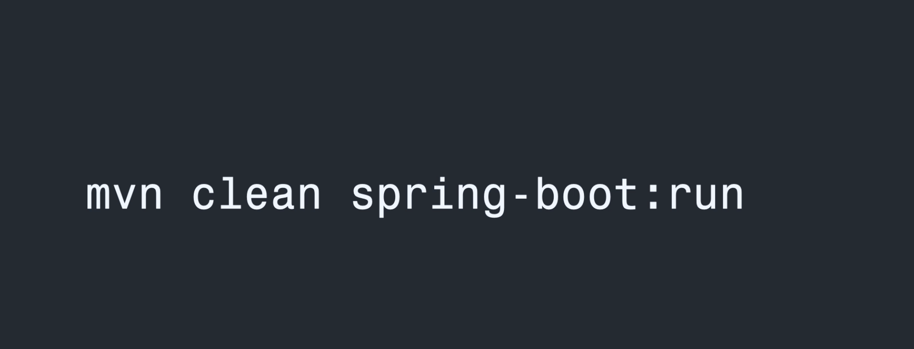

# Read Me First
The following was discovered as part of building this project:

* The original package name 'com.lpt.hello-spring' is invalid and this project uses 'com.lpt.hellospring' instead.

# Getting Started

### Reference Documentation
For further reference, please consider the following sections:

* [Official Apache Maven documentation](https://maven.apache.org/guides/index.html)
* [Spring Boot Maven Plugin Reference Guide](https://docs.spring.io/spring-boot/docs/2.7.2/maven-plugin/reference/html/)
* [Create an OCI image](https://docs.spring.io/spring-boot/docs/2.7.2/maven-plugin/reference/html/#build-image)

  

  

  

  

  
  
  

- run the maven project
  

  

  

> mvn clean spring-boot:run
> ./mvnw clean spring-boot:run
> 
  

  
  

- Client - Server  model for request/response
  

- adding HTTP dependency
- https://mvnrepository.com/
  
  

  

  

- add HTML boiler plate extension
    

- change default port
  
    
